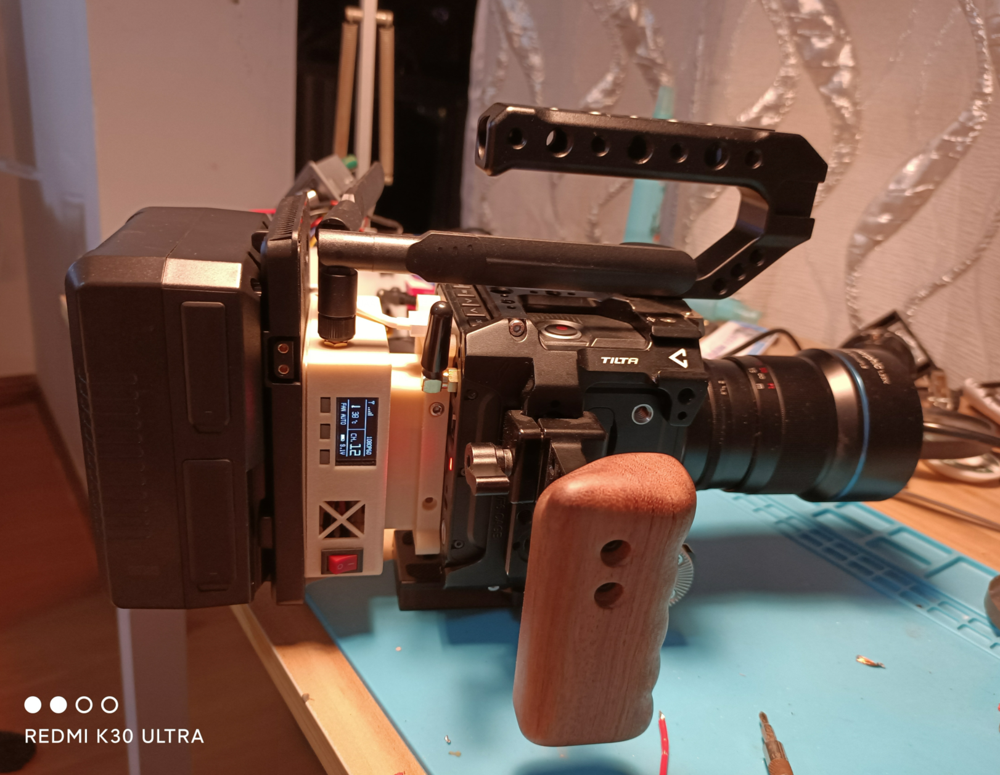
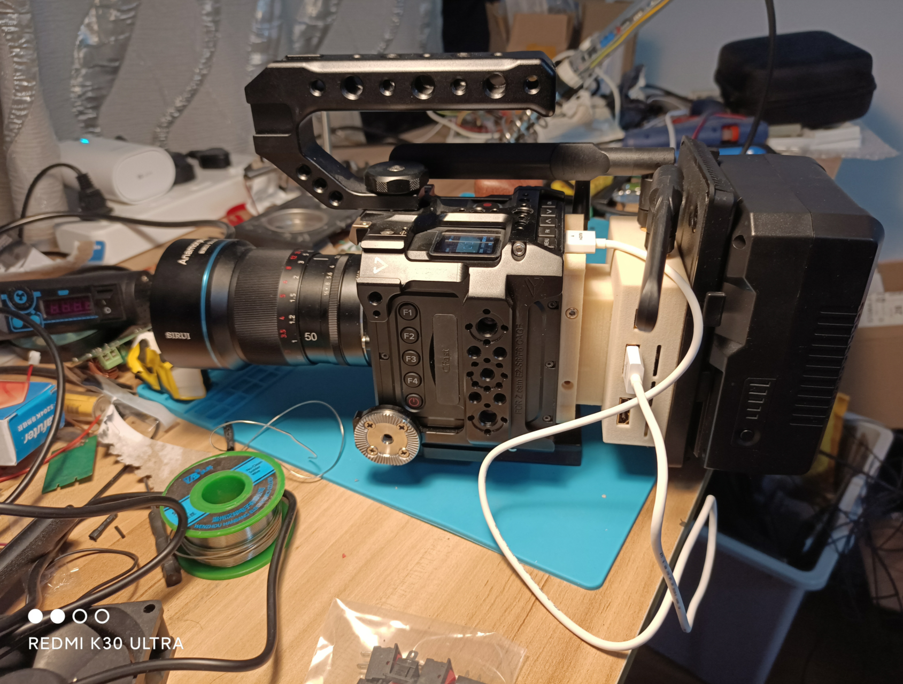
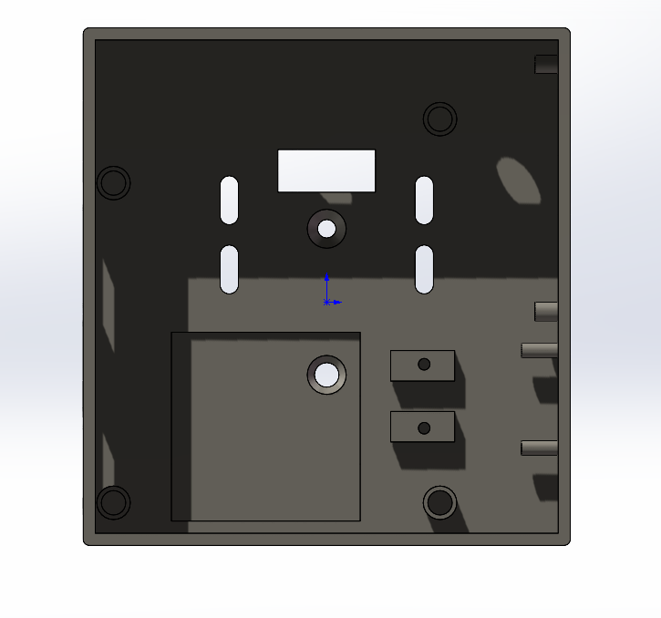
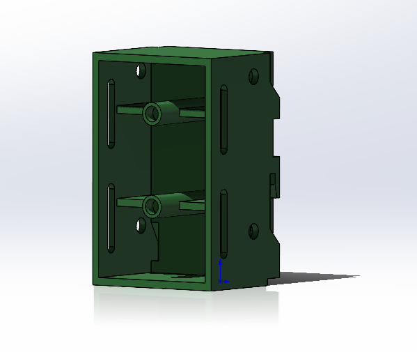
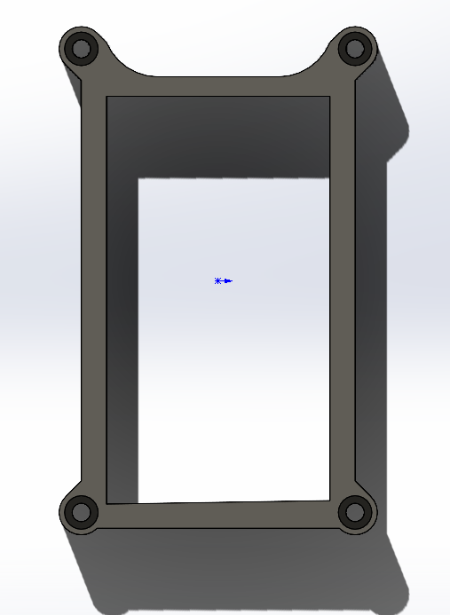
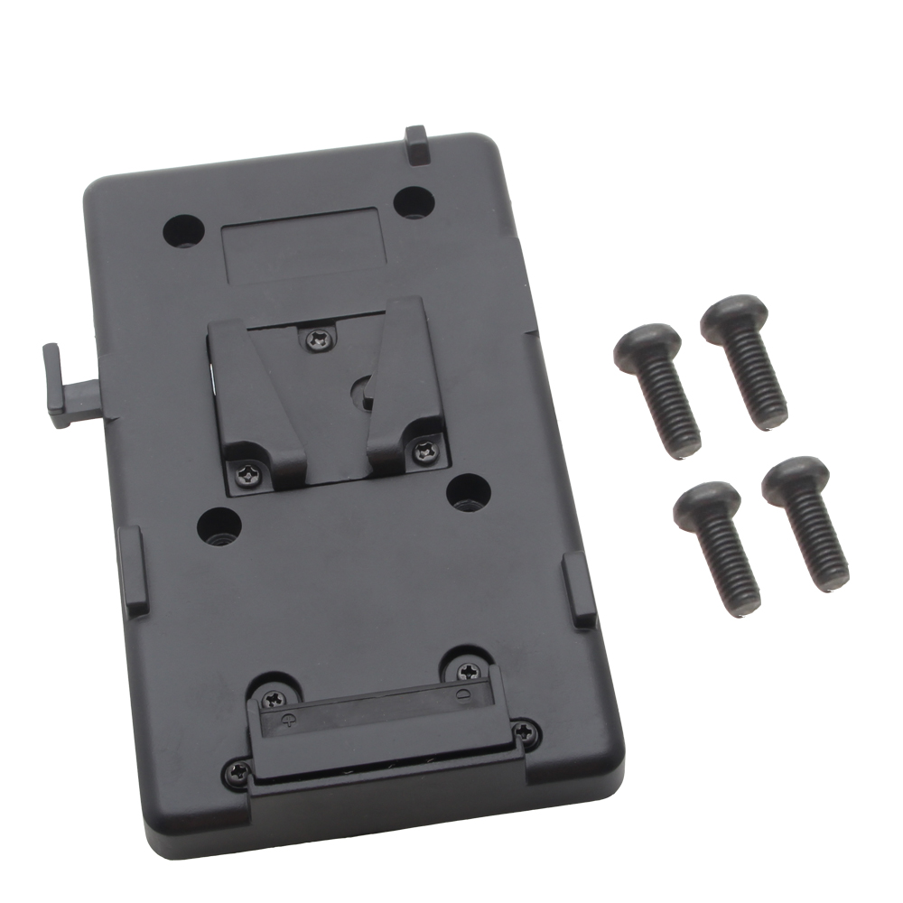

# DIY Vaxis Atom 500kv for Z-CAM E2 

## Description

A backplane for Z-CAM E2 series with Vaxis ATOM 500 wireless transmitter and V-mount battery socket.

No worry for damage your NP-F socket of E2!

## Product images

## Models

model files are at the [models](./models) folder

### 500kv Body

### 500kv Cover

### Battery Connector

### Mount Stand

## Bill of Materials

| No. | Name | PCS | Comment |
|---|---|---|---|
|1|Original Atom 500|1|What we modified|
|2|500kv body|1| 3d printed |
|3|500kv cover|1| 3d printed |
|4|battery connector|1| 3d printed |
|5|mount stand|1| 3d printed |
|6|M3x6 Head Hex Socket| 10 | |
|7|M3x4 Countersunk | 2 | |
|8|M2.5x22  Countersunk | 4 | |
|9|V-mount backplane| 1 | [see below](#v-mount-backplane) |
|10|XH2.54 female cable 20cm | 1 | |

### V-mount backplane

M3 mounting screw distance 44mm

